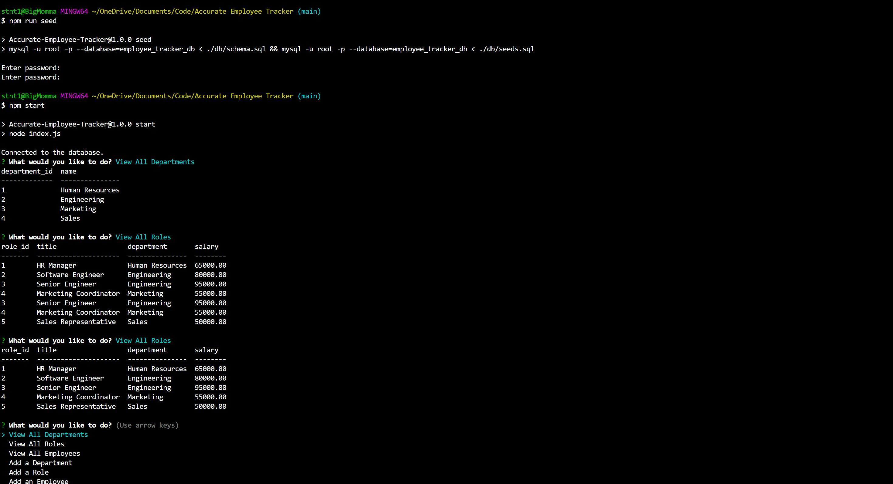

# Accurate-Employee-Tracker
  

My Accurate Employee Tracker is a command-line application built with Node.js, Inquirer, and MySQL that allows businesses and the people that make up that business the ability to manage their employee database efficiently.

  

## Table of Contents

  

- [Installation](#installation)

- [Usage](#usage)

- [Features](#features)

- [Screenshots](#screenshots)

- [Contributing](#contributing)

- [License](#license)

  

## Installation

  

To run the Employee Tracker, follow these steps:

  

1. Clone the repository to your local machine:

  

```bash
git clone https://github.com/yahm0/Accurate-Employee-Tracker
```

2. Navigate to the directory

  

```bash
cd employee-tracker
```
3. Install the dependencies.
```bash
npm install
```
4. Set up your MySQL database and configure the connection settings in a .env file.

5. Seed your database with initial data if needed.
```bash
npm run seed
```
6. Start the application
```bash
npm  start
```
## Usage

Upon  starting  the  application,  you  will  be  presented  with  a  menu  of  options  to  manage  your  employee  database:

  

View  all  departments

View  all  roles

View  all  employees

Add  a  department

Add  a  role

Add  an  employee

Update  an  employee  role

Update  employee  manager

View  employees  by  manager

View  employees  by  department

Delete  a  department

Delete  a  role

Delete  an  employee

View  total  utilized  budget  of  a  department

Exit

Choose  the  desired  action  by  selecting  the  corresponding  option  from  the  menu.

  

## Features

View  and  manage  departments,  roles,  and  employees  in  the  company  database.

Add  new  departments,  roles,  and  employees.

Update  employee  roles  and  managers.

View  employees  by  manager  or  department.

Delete  departments,  roles,  and  employees.

Calculate  and  view  the  total  utilized  budget  of  a  department.

## Screenshots


### Tutorial Video : git@github.com:yahm0/Accurate-Employee-Tracker.git

## Contributing

Contributions  are  welcome!  Please  feel  free  to  submit  a  pull  request  or  open  an  issue  if  you  encounter  any  bugs  or  have  suggestions  for  improvements.

  

## License
MIT License